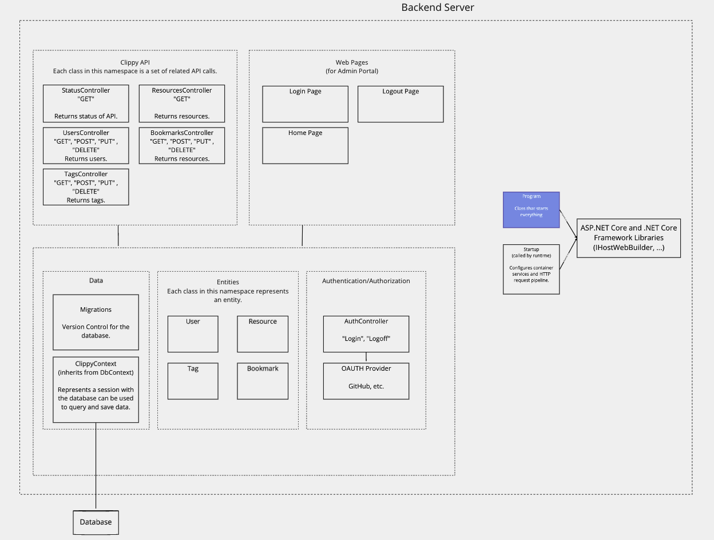

Populate each section with information as it applies to your project. If a section does not apply, explain why. Include diagrams (or links to diagrams) in each section, as appropriate.  For example, sketches of the user interfaces along with an explanation of how the interface components will work; ERD diagrams of the database; rough class diagrams; context diagrams showing the system boundary; etc. Do _not_ link to your diagrams, embed them directly in this document by uploading the images to your GitHub and linking to them. Do _not_ leave any section blank.

# Program Organization

You should have your context, container, and component (c4model.com) diagrams in this section, along with a description and explanation of each diagram and a table that relates each block to one or more user stories.

See Code Complete, Chapter 3 and https://c4model.com/

# Code Design

## Backend Server (from level 4 C4 Model)

## Backend Server Description
The Clippy API is a set of controllers that make up the REST API. Each controller handles a subset of related API requests from the frontend web application. These controllers mainly send and retrieve data from the database.

Various web pages are used by the Admin Portal to administer the database, REST API, configuration settings, and processes.

There is a set of core features used by the Clippy API and the Admin Portal for authentication and authorization, database access and version control.

The API and Admin Portal use Microsoft .NET 5, which requires few classes, such as Program and Startup, to bootstrap and run these services.

### User Story Association

| Class               | User Story IDs                           |
|---------------------|-----------------------------------------|
| StatusController    |                                         |
| UsersController     | 001 016                                 |
| TagsController      | 013                                     |
| ResourcesController | 003 010 017                             |
| BookmarksController | 003 004 006                             |
| AuthController      | 001 016                                 |
| User                | 001 002                                 |
| Resource            | 003 006                                 |
| Bookmark            | 003 004 006                             |
| Tag                 | 013                                     |
| ClippyContext       | 001 002 003 004 006 010 013 016 017 018 |

# Data Design

# Business Rules

You should list the assumptions, rules, and guidelines from external sources that are impacting your program design.

See Code Complete, Chapter 3

# User Interface Design

You should have one or more user interface screens in this section. Each screen should be accompanied by an explaination of the screens purpose and how the user will interact with it. You should relate each screen to one another as the user transitions through the states of your application. You should also have a table that relates each window or component to the support using stories.

See Code Complete, Chapter 3

# Resource Management

See Code Complete, Chapter 3

# Security

See Code Complete, Chapter 3

# Performance

See Code Complete, Chapter 3

# Scalability

See Code Complete, Chapter 3

# Interoperability

See Code Complete, Chapter 3

# Internationalization/Localization

See Code Complete, Chapter 3

# Input/Output

See Code Complete, Chapter 3

# Error Processing

See Code Complete, Chapter 3

# Fault Tolerance

See Code Complete, Chapter 3

# Architectural Feasibility

See Code Complete, Chapter 3

# Overengineering

See Code Complete, Chapter 3

# Build-vs-Buy Decisions

This section should list the third party libraries your system is using and describe what those libraries are being used for.

See Code Complete, Chapter 3

# Reuse

See Code Complete, Chapter 3

# Change Strategy

See Code Complete, Chapter 3
